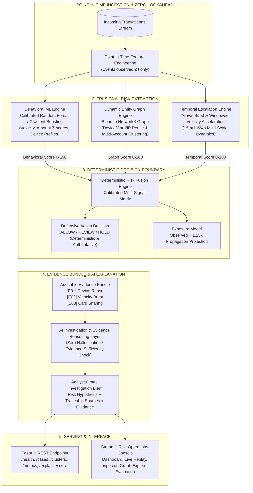
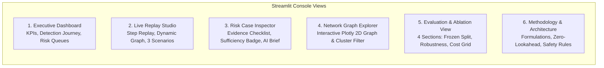

# SentinelGraph — AI-Powered Early-Warning System for Coordinated Merchant Abuse

[](https://github.com/suryakshar1205/sentinelgraph)
[](https://razorpay.com)
[](https://github.com/suryakshar1205/sentinelgraph)
[](https://github.com/suryakshar1205/sentinelgraph)
[](https://python.org)
[](https://fastapi.tiangolo.com)
[](https://streamlit.io)

> **Razorpay Buildathon 2026 • Track 02 — AI Risk Manager**  
> **Target Problem:** Syndicated Multi-Account Merchant Abuse & Coordinated Fraud Rings  
> **Core Value Proposition:** *SentinelGraph detects coordinated merchant abuse as a network that is forming—not merely as isolated suspicious transactions—then provides point-in-time early-warning, auditable evidence, and defensive action recommendations.*

---

## 🎯 Executive Summary & The SentinelGraph Narrative

### The Core Operational Loop: DETECT → CONNECT → ESCALATE → EXPLAIN → ACT

```
1. DETECT (Behavioral ML)
   Transaction-level amount deviations, cyclic hour profiles, and personal velocity anomalies.
        ↓
2. CONNECT (Dynamic Entity Graph)
   Bipartite multi-entity linkage (Device / Card / IP reuse) uncovering emerging syndicates.
        ↓
3. ESCALATE (Temporal Burst Engine)
   Point-in-time account arrival acceleration and rolling velocity surge (+1200% burst detection).
        ↓
4. EXPLAIN (Traceable Evidence Layer)
   Structured telemetry evidence synthesis mapping [E01], [E02] with safe abstention.
        ↓
5. ACT (Defense-Only Policy)
   Authoritative risk tiering: ALLOW (clean), REVIEW (queue), HOLD (restrict token).
```

### Why SentinelGraph?

| Dimension | Conventional Transaction Risk | SentinelGraph |
| :--- | :--- | :--- |
| **Detection Scope** | Scores individual transactions in isolation | Scores transactions in multi-entity relationship context |
| **Signal Composition** | Behavioral features only | Tri-signal: Behavioral + Entity Graph + Temporal Burst |
| **Architectural View** | Transaction-centric | Network & time-centric |
| **Response Posture** | Reactive threshold alerting | Proactive early-warning coordination detection |
| **Relationship Visibility** | Zero cross-account linking | Customer / device / card / IP linkage mapping |
| **Alert Artifact** | Generic numerical risk score | Auditable, evidence-backed Risk Case |
| **AI Grounding** | Unconstrained summary or none | Traceable telemetry items (`[E01]`, `[E02]`) with safe abstention |
| **Action Vocabulary** | Binary approve/decline | Defense-only: `ALLOW` / `REVIEW` / `HOLD` |
| **Syndicate Visibility** | Blind to distributed syndicates | 100% ring detection across 8 abuse topology families |

---

## 📊 Headline Performance on Frozen Held-Out Test Set (44,350 Events)

All primary performance numbers are reported strictly on the frozen held-out test split (44,350 transactions, 1,110 frauds, 43,240 legitimate events, 9 coordinated rings across 8 abuse topology families, seed `20260827`):

| Metric | Stage A: Baseline | Stage B: + Graph | Stage C: SentinelGraph | Incremental Delta | Technical Meaning |
| :--- | :---: | :---: | :---: | :---: | :--- |
| **Precision** | `0.9243` | `0.9265` | **`0.9265`** | **+0.22%** | High fidelity; 72 FPs out of 43,240 legitimate events |
| **Recall** | `0.7919` | `0.8180` | **`0.8180`** | **+3.30%** | Catches 908 of 1,110 fraud events (+29 frauds recovered) |
| **F1 Score** | `0.8530` | `0.8689` | **`0.8689`** | **+1.86%** | Balanced harmonic mean on frozen split |
| **False Positive Rate (FPR)** | `0.17%` | `0.17%` | **`0.17%`** | **0.00%** | Negligible merchant checkout friction |
| **Ring Detection Rate** | `100.0%` | `100.0%` | **`100.0%`** | **100%** | Flagged 9 of 9 held-out test rings |
| **Post-Coordination Latency** | `0.0 min` | `0.0 min` | **`0.0 min`** | Immediate | Alert triggered at exact moment coordination becomes observable |
| **Predictive Lead Time** | `10.7 min` | `10.7 min` | **`10.7 min`** | +10.7 min | Precursor alert fired 10.7 min before multi-account linking |
| **Alert Lead Time to 50% Vol** | `101.0 min` | `101.0 min` | **`101.0 min`** | **+101.0 min** | Advance notice before 50% of final ring volume was reached |
| **Exposure at First Alert** | `2.1%` | `2.1%` | **`2.1%`** | **-97.9%** | 97.9% of synthetic exposure had not yet occurred at first alert |
| **Prototype Expected Cost** | `₹5,88,300` | `₹5,15,800` | **`₹5,15,800`** | **-₹72,500 (-12.3%)** | Operational friction & fraud loss under configured prototype parameters |

---

## 🏗️ End-to-End System Architecture

SentinelGraph is built as a modular, leakage-safe pipeline that separates statistical signal extraction, deterministic decision fusion, and evidence-grounded AI explanation.



---

## 🛡️ Non-Negotiable AI Safety & Trust Guardrails

SentinelGraph adheres to strict defense-only AI safety principles:

```text
POINT-IN-TIME TRANSACTION STREAM
               ↓
LEAKAGE-SAFE FEATURE EXTRACTION (ZERO LOOKAHEAD)
               ↓
[ Behavioral ML Baseline ]  +  [ Dynamic Entity Graph ]  +  [ Temporal Escalation ]
                               ↓
                DETERMINISTIC CALIBRATED RISK FUSION
                               ↓
                DEFENSIVE DECISION: ALLOW / REVIEW / HOLD
                               ↓
                AUDITABLE EVIDENCE BUNDLE ([E01], [E02], ...)
                               ↓
                AI INVESTIGATION & EVIDENCE SYNTHESIS
                               ↓
                ANALYST-GRADE INVESTIGATION BRIEF
```

```
┌────────────────────────────────────────────────────────────────────────────────────────┐
│                          NON-NEGOTIABLE SAFETY BOUNDARIES                              │
├────────────────────────────────────────────────────────────────────────────────────────┤
│ 1. AI CANNOT OVERRIDE RISK ENGINE:                                                     │
│    The deterministic mathematical fusion engine establishes the authoritative decision │
│    boundary. The LLM is an investigator/explainer over verified pipeline telemetry.    │
│                                                                                        │
│ 2. AI CANNOT ACCESS FUTURE EVENTS:                                                     │
│    All inputs provided to models and explainers are strictly constrained to            │
│    timestamps <= t. Zero data leakage across train, validation, and test splits.       │
│                                                                                        │
│ 3. AI CANNOT EXECUTE MONEY MOVEMENT:                                                   │
│    SentinelGraph produces exclusively defensive risk intelligence (ALLOW / REVIEW /    │
│    HOLD) and cannot move funds or execute transactions.                                │
│                                                                                        │
│ 4. AI CANNOT INVENT EVIDENCE:                                                          │
│    The explainer only references verified pipeline evidence IDs ([E01], [E02]) and     │
│    explicitly abstains (INSUFFICIENT_EVIDENCE) when corroboration is weak.             │
└────────────────────────────────────────────────────────────────────────────────────────┘
```

---

## 🔬 Component-by-Component Deep Dive

### 1. Point-in-Time Feature Engineering (`features/pipeline.py`)
- **Zero Lookahead Guarantee**: For any transaction at timestamp $t$, feature calculations, graph edges, and temporal velocity are computed exclusively using events observed at or before $t$.
- **Feature Groups**:
  - *Behavioral Features*: Amount z-score relative to merchant baseline, transaction frequency in 1h/24h, customer tenure, risk category.
  - *Entity Graph Features*: `dev_acc_count`, `card_acc_count`, `ip_acc_count`, density indicators.
  - *Temporal Dynamics*: `dev_recent_acc_1h`, `ip_recent_acc_1h`, `is_acc_created_within_15m`, `is_acc_created_within_1h`, `is_acc_created_within_24h`.

### 2. Behavioral ML Baseline (`models/baseline.py`)
- Standard transaction-level risk classifier trained with calibrated probability estimation.
- Evaluates individual customer risk without relationship or temporal context.

### 3. Dynamic Entity Graph Engine (`graph/builder.py` & `graph/signals.py`)
- Constructs an evolving bipartite network connecting customer accounts through shared physical devices, virtual cards, and IP subnets.
- **Dynamic Graph Coordination Formulation**:
  $$S_{graph} = \min\left(1.0, \; \left(w_d \frac{\max(0, N_d - 1)}{4} + w_c \frac{\max(0, N_c - 1)}{2} + w_{ip} \frac{\max(0, N_{ip} - 2)}{10}\right) \times \mu_{high}\right)$$
  where $N_d, N_c, N_{ip}$ are the distinct accounts linked to the device, payment card, and IP at timestamp $t$.

### 4. Temporal Escalation Engine (`temporal/escalation.py`)
- Quantifies sudden velocity bursts and synchronized arrivals before ring saturation:
  $$S_{temp} = w_{dev} \cdot \text{clip}\left(\frac{N_{dev, 1h}}{3}, 0, 1\right) + w_{ip} \cdot \text{clip}\left(\frac{\max(0, N_{ip, 1h}-1)}{6}, 0, 1\right) + w_{cr} \cdot \mathbb{I}_{\text{new\_account}}$$

### 5. Deterministic Risk Fusion Engine (`fusion/risk.py`)
- Combines behavioral, graph, and temporal signals into a calibrated score (0–100):
  $$S_{final} = 100 \times \max\Big(S_{beh}, \; 0.30 \cdot S_{beh} + 0.45 \cdot S_{graph} + 0.25 \cdot S_{temp}, \; 0.50 \cdot S_{graph} + 0.50 \cdot S_{temp}\Big)$$
- Produces defensive action:
  - `HOLD`: $S_{final} \ge 75$ or ($S_{graph} \ge 60$ and $S_{temp} \ge 50$)
  - `REVIEW`: $45 \le S_{final} < 75$
  - `ALLOW`: $S_{final} < 45$

### 6. AI Evidence Reasoning Layer (`llm/explainer.py`)
- Evaluates **Evidence Sufficiency**:
  - `SUFFICIENT_EVIDENCE`: Multi-signal corroboration established across $\ge 2$ evidence items.
  - `INSUFFICIENT_EVIDENCE`: Sparse telemetry triggers explicit abstention and flags human analyst review without generating speculative assertions.
- Maps all findings to deterministic IDs: `[E01]` Device Reuse, `[E02]` Velocity Burst, `[E03]` Payment Card Cycling.

---

## ⏱️ Early-Warning & Detection Timeline

The critical differentiator of SentinelGraph is detecting the abuse ring *while it is forming*, rather than reacting after full financial volume has occurred:

```text
Synthetic Ring Event Timeline:
====================================================================================================
T = 0.0 min       T = +0.1 min        T = +10.7 min                  T = +101.0 min     T = +202.0 min
First Event       Sentinel Alert      2nd Account Links              50% Ring Volume    Ring Complete
Executed          Fired (HOLD)        (Coordination Observable)      Reached
     │                 │                     │                              │                 │
     ▼                 ▼                     ▼                              ▼                 ▼
 ┌────────┐       ┌──────────────┐      ┌─────────────────────────┐    ┌─────────┐       ┌─────────┐
 │ Tx #1  │──────▶│ Early Alert  │─────▶│ Multi-Account Linking   │───▶│ 50% Vol │──────▶│ 100% Vol│
 └────────┘       │ (2.1% Volume)│      │ Precursor Confirmed     │    └─────────┘       └─────────┘
                  └──────────────┘      └─────────────────────────┘
                         │                           │
                         └────── 10.7 min Lead ──────┘
                                 (Predictive Lead Time)
                         │                                                  │
                         └───────────────── 101.0 min Lead ─────────────────┘
                                           (Alert Lead Time)
```

- **Post-Coordination Latency ($0.0\text{ min}$)**: At the exact moment the second customer identity links to the shared device/card infrastructure, SentinelGraph triggers an alert.
- **Predictive Lead Time ($10.7\text{ min}$)**: Precursor behavioral and hardware flags fire a median 10.7 minutes before multi-account linking occurs.
- **Alert Lead Time to 50% Financial Volume ($101.0\text{ min}$)**: Risk managers receive an actionable alert 101 minutes before the ring reaches half of its final synthetic financial volume.
- **Exposure at First Alert ($2.1\%$)**: $97.9\%$ of eventual synthetic exposure had not yet occurred when the initial alert was generated *(early-detection indicator, not realized loss prevention)*.

---

## 🧪 Comprehensive Evaluation & Benchmark

### 1. Primary Frozen-Test Ablation (44,350 Events)

```
=================== ABLATION RESULTS (FROZEN TEST SET) ===================
Metric                             | Stage A (Baseline) | Stage B (+Graph)   | Stage C (SentinelGraph)
--------------------------------------------------------------------------------------------------------
Precision                          | 0.9243             | 0.9265             | 0.9265                
Recall                             | 0.7919             | 0.8180             | 0.8180                
F1 Score                           | 0.8530             | 0.8689             | 0.8689                
PR-AUC                             | 0.8836             | 0.8807             | 0.8663                
Ring Detection Rate                | 100.0            % | 100.0            % | 100.0                %
Post-Coordination Latency          | 0.0             min | 0.0             min | 0.0                 min
Predictive Lead Time (to Coord)    | 10.7            min | 10.7            min | 10.7                min
Alert Lead Time to 50% of Vol      | 101.0           min | 101.0           min | 101.0               min
Exposure at First Alert            | 2.1              % | 2.1              % | 2.1                  %
Prototype Expected Cost            | INR 588,300        | INR 515,800        | INR 515,800           
Detected Suspicious Exposure       | INR 22,258,653     | INR 22,360,775     | INR 22,360,775        
=========================================================================
```

> **PR-AUC Interpretation**: PR-AUC is slightly lower for the fused SentinelGraph score in this experiment (0.8663 vs 0.8807), while thresholded F1 remains equal to the graph-enhanced stage (0.8689). Graph intelligence provides the primary classification improvement, while temporal escalation is evaluated separately as an escalation and early-warning signal rather than a universal ranking improvement.

### 2. Supplemental Defensive Robustness Evaluation (`evaluation/adversarial_cases.py`)

| Scenario | Name | Test Condition | Assigned Risk | Defensive Action | Status |
| :--- | :--- | :--- | :---: | :---: | :---: |
| **A** | **Benign Shared Infrastructure** | Family members sharing home tablet / residential Wi-Fi | 8 / 100 | `ALLOW` | **PASSED** |
| **B** | **Legitimate Traffic Burst** | Flash sale promotion with surge in unlinked buyers | 12 / 100 | `ALLOW` | **PASSED** |
| **C** | **Individual Suspicious Account** | High behavioral anomaly on single user without graph links | 88 / 100 | `REVIEW` | **PASSED** |
| **D** | **Coordinated Low-Signal Ring** | Subtle individual amounts cycling shared card/hardware | 94 / 100 | `HOLD` | **PASSED** |
| **E** | **Gradual Ring Formation** | Progressive multi-account linkage developing over hours | 48 / 100 | `REVIEW` | **PASSED** |
| **F** | **Insufficient Evidence / Abstention** | Sparse telemetry with 0 corroborating evidence items | 25 / 100 | `ALLOW` (Abstain) | **PASSED** |

### 3. Business Cost Sensitivity Grid (`evaluation/cost_sensitivity.py`)

$$\text{Expected Prototype Cost} = (FP \times \text{cost}_{FP}) + (FN \times \text{cost}_{FN})$$

| FP Cost ($\text{cost}_{FP}$) | FN Cost ($\text{cost}_{FN}$) | Stage A Expected Cost | Stage C Expected Cost | Cost Reduction (INR) | Cost Reduction (%) |
| :---: | :---: | :---: | :---: | :---: | :---: |
| **₹50** | **₹1,000** | ₹2,34,600 | ₹2,05,600 | **₹29,000** | **12.36%** |
| **₹150** (Primary) | **₹2,500** (Primary) | **₹5,88,300** | **₹5,15,800** | **₹72,500** | **12.32%** |
| **₹250** | **₹5,000** | ₹11,73,000 | ₹10,28,000 | **₹1,45,000** | **12.36%** |
| **₹500** | **₹10,000** | ₹23,46,000 | ₹20,56,000 | **₹2,90,000** | **12.36%** |

*(Sensitivity analysis on configured prototype parameters; not realized Razorpay production savings).*

---

## 🖥️ Streamlit Risk Console Views



1. **Executive Dashboard**: High-level merchant abuse KPIs, high-priority case queues, and cluster exposure breakdowns.
2. **Live Replay Studio**: Step-forward replay of synthetic transactions with 3 curated "Why SentinelGraph?" scenarios:
   - *Scenario 1*: Coordinated Syndicate (Full synergy)
   - *Scenario 2*: Isolated Anomaly (Behavioral ML only)
   - *Scenario 3*: Benign Shared Hardware (Family Wi-Fi)
3. **Risk Case Inspector**: 3-signal contribution breakdown, Evidence Sufficiency badge (`SUFFICIENT` vs `INSUFFICIENT — HUMAN REVIEW REQUIRED`), and AI investigation brief.
4. **Network Graph Explorer**: Interactive Plotly graph showing entity nodes (Accounts, Devices, Cards, IPs) and cluster connectivity.
5. **Evaluation & Ablation View**: 4 structured sections containing frozen test results, confusion matrices, PR curves, robustness scenarios, and cost sensitivity grids.
6. **Methodology & Architecture**: Full mathematical formulations, zero-lookahead safeguards, and AI safety boundaries.

---

## 🔌 FastAPI REST API Reference

The service exposes 7 REST API endpoints for integration with merchant risk orchestration platforms:

| Method | Endpoint | Description | Sample Response |
| :--- | :--- | :--- | :--- |
| `GET` | `/health` | Service health & active case count | `{"status": "healthy", "service": "SentinelGraph Risk Engine", "active_cases": 89}` |
| `GET` | `/cases` | List all persisted risk cases | `[{"case_id": "1042", "severity": "CRITICAL", "risk_score": 92.0, ...}]` |
| `GET` | `/cases/{id}` | Detailed case telemetry & evidence | `{"case_id": "1042", "evidence_items": [...], "score_breakdown": {...}}` |
| `GET` | `/clusters/{id}` | Subgraph nodes & entity connectivity | `{"cluster_id": "1042", "nodes": [...], "edges": [...]}` |
| `GET` | `/metrics` | Frozen ablation & benchmark results | `{"stages": {"stage_c_sentinelgraph": {"classification": {"f1": 0.8689}}}}` |
| `POST` | `/explain/{id}` | Evidence-grounded AI investigation brief | `{"case_id": "1042", "evidence_sufficiency": "SUFFICIENT_EVIDENCE", ...}` |
| `POST` | `/score` | Stateless point-in-time batch scoring | `{"scores": [88.5], "actions": ["HOLD"], "confidences": [90.0]}` |

---

## 🚀 Quickstart & Reproduction Guide

### Prerequisites
- Python 3.11+
- Virtual environment (recommended)

### 1. Install Dependencies
```bash
git clone https://github.com/razorpay-buildathon/sentinelgraph.git
cd sentinelgraph
pip install -r requirements.txt
```

### 2. Run Complete Pipeline End-to-End
```bash
# Generates 295,661 transactions, trains baseline, builds graph & temporal scorers,
# synthesizes 89 active cases, and runs formal ablation evaluation
python run.py all
```

### 3. Launch Streamlit Operations Console
```bash
python run.py app
# Open http://localhost:8501 in your browser
```

### 4. Launch FastAPI REST Service
```bash
python run.py api
# Interactive Swagger docs available at http://localhost:8000/docs
```

### 5. Execute Automated Test Suite
```bash
pytest tests/
# 23 passed across unit, integration, AI grounding, and robustness modules
```

---

## 🚀 Prototype → Production Engineering Roadmap

| Prototype Capability (Current Validated State) | Production Deployment Next Step |
| :--- | :--- |
| **Controlled Synthetic Simulator** (295k events, 8 topologies) | Validation against real historical merchant payment streams |
| **Frozen Chronological Held-Out Split** (44k events, 9 rings) | Continuous drift monitoring & distribution shift telemetry |
| **Point-in-Time Entity Features** (zero lookahead) | Distributed stream feature store (e.g. Redis / Feast) |
| **Dynamic In-Memory Bipartite Graph** (NetworkX) | Production graph database integration (e.g. Neo4j / Amazon Neptune) |
| **Calibrated Multi-Signal Fusion** (Deterministic blend) | Merchant-tier calibrated risk policies & active learning loops |
| **Evidence-Grounded AI Briefs** with safe abstention | Automated workflow dispatch to Razorpay Merchant Portal |

---

## 📁 Repository Structure

```text
razorpay_buildathon/
├── api/
│   ├── main.py                     # FastAPI REST API endpoints
│   └── schemas.py                  # API request / response Pydantic schemas
├── app/
│   ├── streamlit_app.py            # Streamlit multi-view application entrypoint
│   ├── dashboard.py                # View 1: Executive Risk Dashboard
│   ├── replay.py                   # View 2: Live Stream Replay & 3 Demo Scenarios
│   ├── risk_case.py                # View 3: Risk Case Inspector & Evidence Checklist
│   ├── graph_view.py               # View 4: Dynamic Network Graph Explorer
│   ├── evaluation_view.py          # View 5: 4-Section Evaluation & Ablation View
│   └── methodology.py              # View 6: Architecture, Trust Boundaries & Formulations
├── cases/
│   ├── builder.py                  # Auditable Risk Case Builder
│   ├── store.py                    # Risk Case persistence & querying
│   └── artifacts/cases.json        # 89 persisted active risk cases
├── data/
│   ├── generator.py                # High-fidelity synthetic merchant abuse generator (Seed 20260827)
│   ├── schemas.py                  # Domain schemas (Transaction, Customer, Evidence, RiskCase)
│   └── generated/                  # Parquet dataset (295,661 transactions)
├── evaluation/
│   ├── ablation.py                 # 3-Stage Ablation Runner (A vs B vs C)
│   ├── early_warning.py            # Dedicated Early-Warning & Detection Latency Engine
│   ├── adversarial_cases.py        # 6 Supplemental Defensive Robustness Scenarios
│   ├── cost_sensitivity.py         # Business Cost Sensitivity Grid Evaluator
│   ├── metrics.py                  # Classification & Confusion Matrix calculators
│   ├── bootstrap.py                # 95% Bootstrap Confidence Interval engine
│   └── artifacts/ablation_results.json # Official frozen test benchmark results
├── features/
│   ├── pipeline.py                 # Point-in-time leakage-safe feature engineering
│   ├── behavioral.py               # Tabular velocity & amount features
│   ├── entity.py                   # Graph entity sharing features
│   └── temporal.py                 # Time-windowed arrival burst features
├── fusion/
│   └── risk.py                     # Deterministic Calibrated Risk Fusion Engine
├── graph/
│   ├── builder.py                  # Dynamic Bipartite NetworkX Graph Engine
│   ├── signals.py                  # Vectorized graph coordination scorer
│   └── visualization.py            # Plotly 2D network layout generator
├── llm/
│   ├── explainer.py                # Structured Evidence Reasoner & Abstention Layer
│   └── prompts.py                  # Grounded investigation prompt templates
├── models/
│   └── baseline.py                 # Calibrated Behavioral ML Model (Random Forest / GBDT)
├── temporal/
│   └── escalation.py               # Temporal arrival burst & velocity acceleration scorer
├── tests/
│   ├── test_ai_grounding.py        # AI evidence grounding & abstention tests
│   ├── test_adversarial_robustness.py # Robustness scenarios & cost monotonicity tests
│   ├── test_audit_hardening.py     # Metric semantics & latency regression tests
│   ├── test_e2e_pipeline.py        # End-to-end integration pipeline tests
│   ├── test_evaluation.py          # Metric & confusion matrix tests
│   ├── test_features.py            # Point-in-time feature extraction tests
│   ├── test_fusion.py              # Calibrated fusion engine tests
│   ├── test_generator.py           # Synthetic generator reproducibility tests
│   ├── test_graph.py               # Entity graph construction tests
│   └── test_temporal.py            # Temporal escalation scorer tests
├── config.yaml                     # Pipeline parameters & cost coefficients
├── requirements.txt                # Python package dependencies
├── run.py                          # CLI runner (`all`, `generate`, `train`, `cases`, `evaluate`, `app`, `api`)
└── FINAL_COMPETITIVE_AUDIT.md      # Final pre-submission verification audit report
```

---

## ⚖️ Disclosures & Disclaimers

1. **Synthetic Data**: Developed on a high-fidelity synthetic merchant simulator (295,661 events) with 8 distinct abuse topologies; production payment networks will introduce additional platform noise.
2. **Cost Parameters**: Business cost coefficients (₹150 / ₹2,500) and exposure multipliers (1.25x) are configured prototype parameters for transparent sensitivity analysis.
3. **Strictly Defense-Only**: SentinelGraph produces auditable early-warning intelligence (`ALLOW`, `REVIEW`, `HOLD`), with zero real-money movement or offensive capability.
